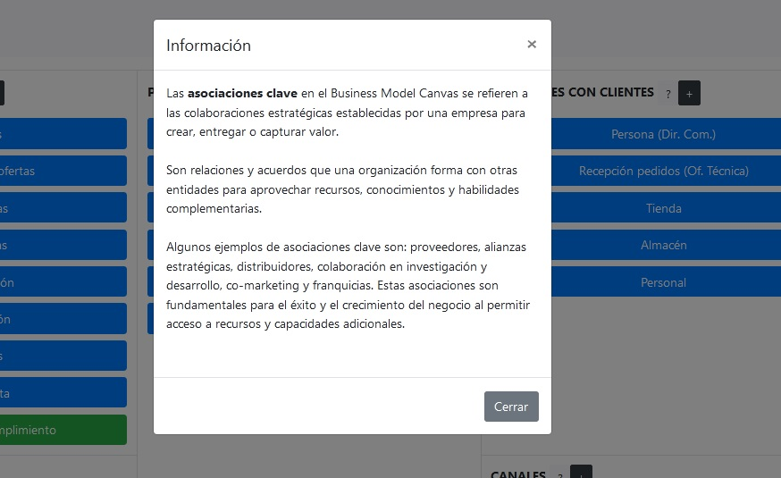
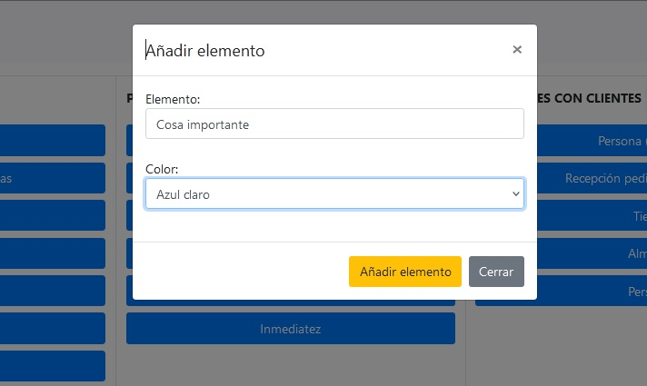
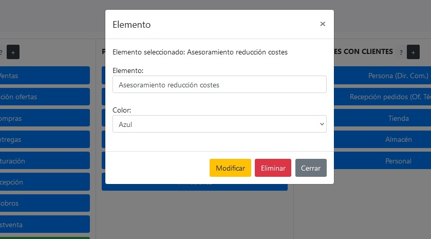

# businesscanva
Aplicación web que permite gestionar un lienzo de modelo de negocio de forma visual e interactiva. Realmente es una prueba de concepto, pero no tengo previsto hacer actualizaciones en el código. Muchos parámetros, como el nombre de la empresa, son configurables directamente modificando los archivos .dat, sin necesidad de tocar código para personalizarlo. 

* Visión general: Permite observar el tablero del modelo de negocio en su conjunto, pudiendo ajustar el zoom (tamaño de los elementos) de la página.

* Botones de información: Permite recordarle rápidamente al usuario las descripciones de cada bloque.

* Utilización de cuadros modales para introducción de nuevos elementos en los bloques.

* Edición, eliminación y personalización de elementos.

Este programa responde a una necesidad concreta de gestionar un modelo de negocio de manera visual e interactiva en el navegador, y no está pensado para instalarse en hostings de acceso público, sino para accederse siempre desde local (no hay ninguna medida de seguridad implementada). Una forma sencilla de ejecutarlo sería acceder a la carpeta donde estén los archivos y ejecutar: 

      php -S localhost:80

Posteriormente, bastaría con acceder desde cualquier navegador al servidor de desarrollo de PHP:

      http://localhost

Este programa es una implementación interactiva de un business model canva según he analizado en el trabajo de Osterwalder, Pigneur y otros autores en la obra "Generación de modelos de negocio".

# Advertencia

No instales, ejecutes o publiques esta aplicación en lugares comprometidos. En serio, fue creado para demostrar una funcionalidad, no para ser "usado".
